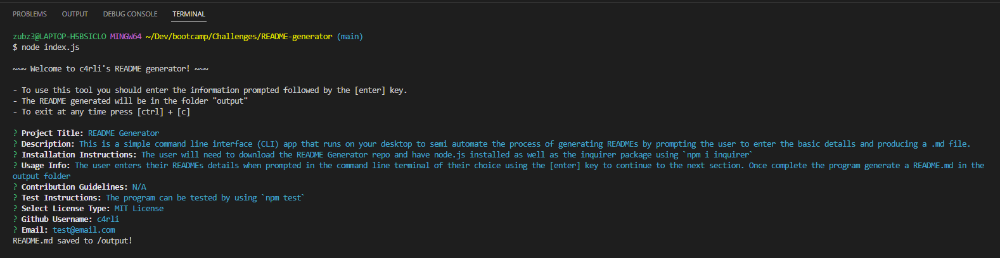
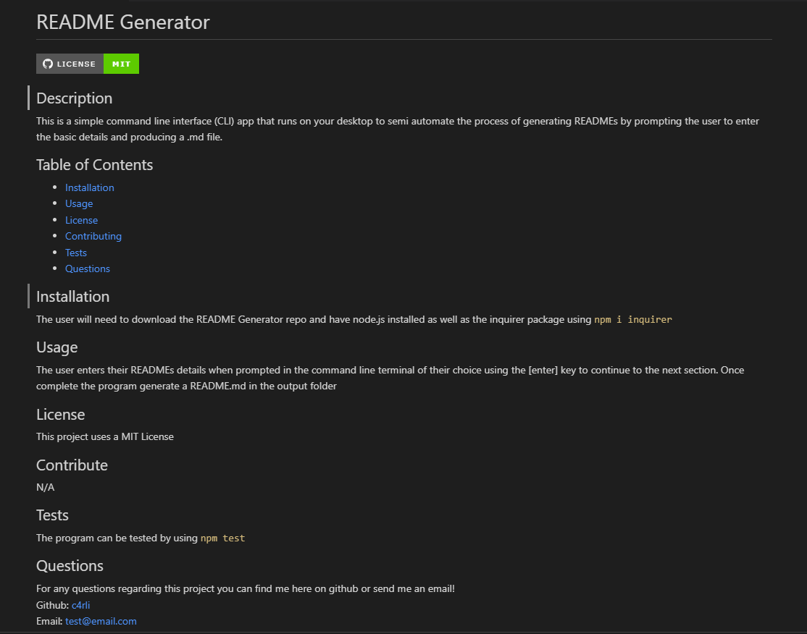

# README Generator
CLI program to generate .md files with ease. Powered using node.js and inquirer.

## Description
This is a simple command line interface (CLI) app that runs on your terminal to semi automate the process of generating READMEs by prompting the user to enter the basic details and producing a .md file. 

### My User Story:
```
AS A developer
I WANT a README generator
SO THAT I can quickly create a professional README for a new project
```

### Features:
- Generates complete README.md file.
- Creates functional Github and email links at bottom of page.
- License badge updates depending on the license selected.

### CLI View:

### Preview of README generated:


## Installation
The user will need to download the README Generator repo and have node.js installed as well as the inquirer package using `npm i inquirer`<br>
### Demonstration:
[README Generator Demo](https://drive.google.com/file/d/1qKSbv02SmmIStlWDtLVQq7nm4HqOGNkb/view?usp=sharing) 

## Usage
The user enters their READMEs details when prompted in the command line terminal of their choice using the [enter] key to continue to the next section. Once complete the program generate a README.md in the output folder

## Credits
Source code written by carli n. aka c4rli ++

## License

